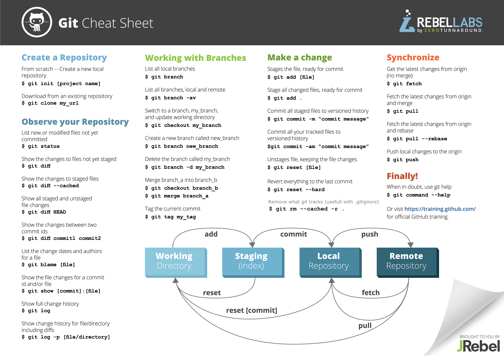

# Git Introduktion
Git er et system der bruges til at holde styr på ens kildetekst over tid. Det er et system der kan rigtigt meget på rigtigt mange forskellige måder. 

## Læringsmål
Ideen er at du efter at have arbejdet med denne note skal:

- kunne arbejde sammen i en gruppe om kildetekst
- kunne bruge git fra git bash til at lave nye versioner og hente andres opdateringer
- lave dit egen konto på github og oprette projekter og dele dem

## Erhvervsrelevans
Der findes ikke nogen steder, hvor man udvikler software, uden at have et versionshåndteringssystem. Git er idag blandt de mest udbredte.

##  Baggrundsmateriale
- [Gratis e-bog](https://git-scm.com/book/en/v2) om Git
- [LinkedIn Learning video](https://www.linkedin.com/learning/git-essential-training-the-basics/use-git-version-control-software-to-manage-project-code?u=36836804) Git Essential Training: kapitel 1-5


## Hvorfor et version styringssystem?
Der er en række situationer som et versionssystem skal kunne håndtere. Nogle eksempler er:

- Tillade at to udviklere arbejder på hver sin del, og så hjælpe med at *flette* de to dele sammen igen.
- At kunne lægge en tidligere version til side - for eksempel lave en version, som lige præcis er det system, der blev leveret til kunde A, så vi kan se hvad der er rettet af fejl siden da.
- At kunne prøve en ny idé af, og smide den ud, hvis det ikke duer.
- Kildekode er din virksomheds levebrød. Versionssystemer fungerer også som back-up.

## Git begreber

### Workspace
Workspace (arbejdsområde) er de filer, der er i din normale filstruktur. Tænk på et IntelliJ projekt som et eksempel.

### Snapshot
Et snapshot er en kopi af dit workspace, som man kan vende tilbage til (vende tilbage til betyder at det er nemt at kopiere et snapshot tilbage i workspace).

### Repository 
Repository (lager) er, hvor git lægger snapshots af workspace til side, så man kan vende tilbage til det, hvis der bliver behov for det. I praksis arbejder man med to repositories i git:

* Et *lokalt repository*, som er på din egen maskine. Det tillader, at du kan lave nye snapshots selv. Det lokale repository er i et katalog der hedder ".git" i roden af dit IntelliJ projekt.
* Et *delt repository*, som ligger på en server, som alle i teamet kan tilgå.

#### Staging area (også kaldet "index")
Dette er et specielt snapshot, som git holder styr på, men som endnu ikke er lagt i repository (staging area kan vel her oversættes til "byggepladsen"). Avancerede brugere kan lave alle mulige sjove ting med det. Vi kommer blot til at bruge det som mellemled mellem workspace og lokalt repository.

### Git kommandoer
Der er nogle få kommandoer vi kommer til at bruge fra git-bash:

`git status` 

* denne kommando fortæller dig:

  * hvilke filer, der er nye i workspace (i forhold til staginging area)
  * hvilke filer, der er ændret i workspace (i forhold til staginging area)
  * hvilke filer, der er nye/ændrede i staging area sammeholdt med seneste snapshot i lokal repository
  * forholdet mellem dit lokale repository og det delte repository

`git add .` 

* tilføjer alle ændringer i workspace til staging area.

`git commit -m" beskrivelse"` 

* lægger snapshot fra staging area over i lokal repository. Beskrivelsen skal kort sige, hvad du ændrede i denne version.

`git log`

* giver en liste over de snapshots, der er i repository. 

`git clone URL`

* bruges til at lave en lokal kopi af et delt repository. Dette er langt den nemmeste måde at starte et lokalt repository.

`git push`

* opdaterer det delte repository til også at inkludere de snapshots, du har i dit lokale repository

`git pull`

* opdaterer dit lokale repository til også at have de snapshots, der er i det delte repository

Dette er en oversigt over de mest brugte kommandoer i git. Og vi vil næppe bruge ret mange af dem.




## Opsætning
Der er flere måder at gøre det på, men det *nemmeste* er at starte på github. 

### Lav et nyt projekt på github
1. Du skal oprette en konto på github
2. Dernæst skal du oprette et nyt repository (det er det lille "+" i øverste højre hjørne)
3. Du vil blive spurgt om navn på repository - tænk på dette navn som det samme navn du ville bruge til et IntelliJ projekt
4. LAV README FILEN!!!!

Du skulle nu gerne se noget der minder om dette:


### Gitignore
Dette er en lille knast, vi skal over. Når vi siger `git add .` så vil git lægge alle nye eller ændrede filer i workspace over i staging area. Men der er mange ting der *ikke* skal med. F.eks.

* Filer der er specifikke til Mac (ikoner mv)
* Filer der er specifikke til Windows (ikoner mv)
* Filer der indeholder personlige indstillinger for netbeans
* Filer der er oversatte java programmer

For at gøre dette til at holde ud i praksis, så kan man lave en speciel fil der hedder `.gitignore` som placeres øverst i projektet. 

1. Download denne [.gitignore](sample_gitignore.txt) fil. (som er en, jeg har lavet)
2. På det nye projekt i github, vælg den knap der hedder "Create new file" (lidt til venstre for den store grønne knap).
3. Dette åbner et vindue hvor du kan  paste indholdet fra den downloadede `.gitignore` fil ind, og du kan navngive filen ".gitignore". - Github opdager du er ved at lave en gitignore fil, men den hjælp den giver er ikke god nok!.
4. skriv en kort besked i "commit changes" (f.eks. *tilføjede .gitignore fil*)

### Clone repository
Hvis du trykker på den store grønne knap, kommer der en mulighed frem hvor du kan vælge "copy url til clipboard":


### Så skal du over i Git Bash....

Download https://git-scm.com/downloads og installér (følg default settings i installationsprocessen medmindre du har særlige præferencer).

### Kom i gang
Jeg vil anbefale at du laver et katalog i dit filsystem, som du bruger til git-projekter. Flyt dig derhen vha. `cd` kommandoen.

I kommando prompten skal du så skrive `git clone URL`, hvor URL er det du kopiere de fra github.

git clone kommandoen skulle så gerne skrive noget i stil med:

```
$ git clone https://github.com/kaspercphbusiness/test100.git
Cloning into 'test100'...
remote: Counting objects: 7, done.
remote: Compressing objects: 100% (5/5), done.
remote: Total 7 (delta 1), reused 0 (delta 0), pack-reused 0
Unpacking objects: 100% (7/7), done.
$
```


**Tillykke, du har nu dit første lokale git repository!**


#### Kopier filer ind i workspace
Du har sikkert allerede et IntelliJ projekt. Du kan nu kopiere filerne ind i det nyt git projekt og bruge `git log` og `git status` til at se, hvad der er sket ind til videre.

Der findes andre metoder til at sætte det op. Det er muligt at starte med at lave et lokalt repository, og så senere sætte det på som delt repository. Men metoden ovenfor virker.
